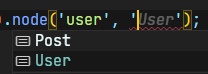
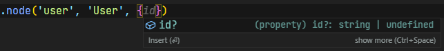
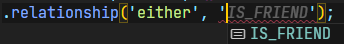

# cypher-builder

Fluent CQL Builder for Neo4j

## 🚨🚨🚨 Warning 🚨🚨🚨

**This package is in early stages of development, use it at your own risk.**

## Installation

```bash
npm install @douglasgabr/cypher-builder
```

or

```bash
yarn add @douglasgabr/cypher-builder
```

## Usage

### Type inference (required for typescript projects)

First, you must create a `*.d.ts` file in your project, in order to type the possible nodes, relationships and their properties.

```typescript
// neo4j-types.d.ts
import '@douglasgabr/cypher-builder';

declare module '@douglasgabr/cypher-builder' {
  export interface CypherBuilderNodes {
    User: {
      id: string;
    };
  }

  export interface CypherBuilderRelationships {
    KNOWS: {
      level: 'friendship' | 'colleague';
    };
  }
}
```

That will enable your IDE (tested only in VSCode) to suggest values for your node labels, relationship types and its properties.

**Node Label suggestion:**



**Node Properties suggestion:**



**Relationship Type suggestion:**



### Example

```typescript
import { Builder, RelationshipDirection } from '@douglasgabr/cypher-builder';

const queryBuilder = new Builder()
  .match((match) => {
    match
      .node('person', 'Person', { name: 'Alice' })
      .relationship('either', 'KNOWS')
      .node('friend', 'Person'),
  })
  .where((where) => where.and('friend.age', '>=', 18))
  .return('person', 'friend');
const { query, parameters } = queryBuilder.buildQueryObject();
```

query:

```
MATCH (person:Person{ name: $person_name })-[:KNOWS]-(friend:Person)
WHERE friend.age >= $friend_age
RETURN person, friend
```

parameters:

```typescript
{
  person_name: 'Alice',
  friend_age: 18
}
```
